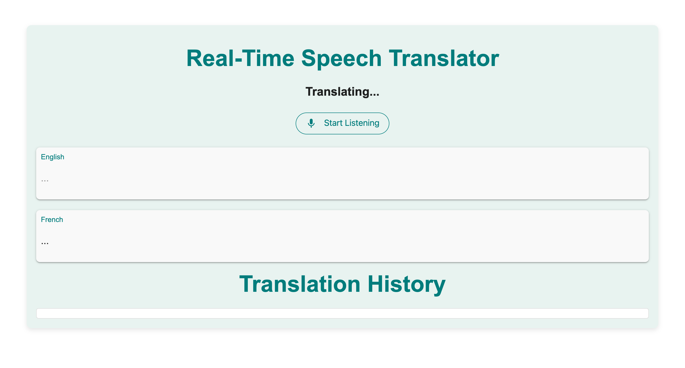
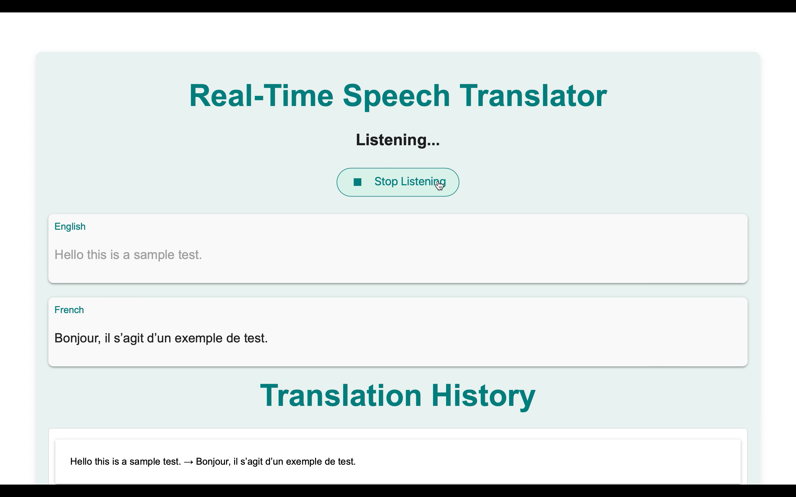
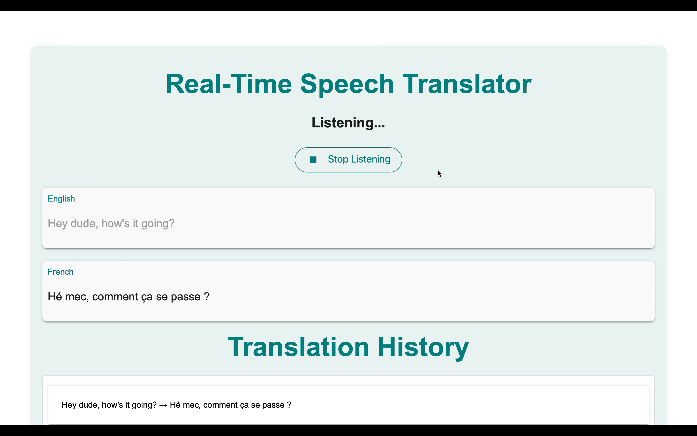

# [](https://psairam9301.wixsite.com/website) [](https://www.youtube.com/@sairampenjarla) [](https://github.com/sairam-penjarla) [](https://www.linkedin.com/in/sairam-penjarla-b5041b121/) [](https://www.instagram.com/sairam.ipynb/)

# **🗣️ Real-Time Speech Translator (Azure + Flask + Material UI)**  

This project is a **real-time speech recognition and translation tool** powered by **Azure Speech Service & Flask**. The UI is built using **Google's Material Design**, creating a modern, minimalistic experience.  

Users can **speak into the microphone**, see the **real-time transcription**, and get an **instant translation into French**. The UI updates dynamically, storing past translations.

---

## **📸 Screenshots**

  
  
  
  

---

## **📥 Installation & Setup**

### **1️⃣ Clone the Repository**
```sh
git clone https://github.com/sairam-penjarla/azure_ai_speech.git
cd azure_ai_speech
```

### **2️⃣ Create a Virtual Environment**
Follow this [Blog Post](https://sairampenjarla.notion.site/Environment-171d56a2fc2780dd9efcd4cef331fa2c) to learn how to set up a virtual environment.

Using `venv`:
```sh
python -m venv env
source env/bin/activate  # On macOS/Linux
env\Scripts\activate     # On Windows
```

Using `conda`:
```sh
conda create --name myenv python=3.9
conda activate myenv
```

### **3️⃣ Install Dependencies**
```sh
pip install -r requirements.txt
```

### **4️⃣ Set Up `.env` File**
Create a `.env` file in the root directory and add your **Azure Speech Service credentials**:
```
AZURE_SPEECH_KEY=your_speech_service_key
AZURE_SPEECH_REGION=your_speech_service_region
```

### **5️⃣ Run the Flask App**
```sh
python app.py
```

### **6️⃣ Open in Browser**
```
http://127.0.0.1:5000/
```

---

## **📂 Folder Structure**
```
/azure_ai_speech
│── /static
│   ├── styles.css  # Google Material Design UI
│── /templates
│   ├── index.html  # Main frontend UI
│── app.py  # Flask backend, speech recognition & translation
│── .env  # Environment variables (Azure credentials)
│── requirements.txt  # Python dependencies
│── README.md  # Documentation
```

---

## **⚙️ Tech Stack**
### **Frontend**
- **Google Material Design** (Materialize CSS, Material Icons, Roboto Font)
- **HTML, CSS, JavaScript**
- **Socket.IO** (real-time UI updates)

### **Backend**
- **Flask** (Python microframework)
- **Flask-SocketIO** (real-time communication)
- **Azure Speech Service** (speech-to-text & translation)
- **dotenv** (for managing API keys)

### **Deployment**
- Runs **locally** using Flask  
- Can be deployed to **Azure App Services** or any cloud provider  

---

## **🚀 Features**
✔ 🎤 **Voice Input**: Click the microphone to start listening  
✔ 🔄 **Real-time Speech Recognition**: Recognizes English speech dynamically  
✔ 🌍 **Live Translation**: Converts English speech into **French** instantly  
✔ 📜 **Translation History**: Stores previous translations  
✔ 🔄 **Dynamic UI Updates**: Mic button changes based on status (**Listening, Translating, Idle**)  
✔ 🎨 **Material UI**: Clean, minimal UI inspired by Google Translate  
✔ 📱 **Mobile-Responsive**: Works on desktop & mobile  

---

## **🛠️ How It Works**
1️⃣ **Click Mic Button** → Starts **listening**, updates status to *Listening...*  
2️⃣ **Speech is Recognized** → Displays **real-time text in English**  
3️⃣ **Click Mic Again** → Stops **listening**, shows *Translating...*  
4️⃣ **Translation Appears** → Displays **English + French** translation  
5️⃣ **History Updates** → Stores **previous translations**  

---

## **🔗 Blog Post**
For a detailed explanation, check out this blog post: [📖 Read More](https://sairampenjarla.notion.site)

---

## **📌 Future Enhancements**
- [ ] **Support for More Languages** (Dynamic selection)  
- [ ] **Improved UI Animations** (Loading effects)  
- [ ] **Deploy to Azure App Service** for online access  
- [ ] **Add Speech-to-Text History Storage** in a database  

---

## **🤝 Contributing**
Want to contribute? Feel free to **fork the repo**, make changes, and submit a **pull request**.

---

## **📞 Contact**
🌐 **Website:** [Visit Here](https://psairam9301.wixsite.com/website)  
📷 **Instagram:** [Follow Me](https://www.instagram.com/sairam.ipynb/)  